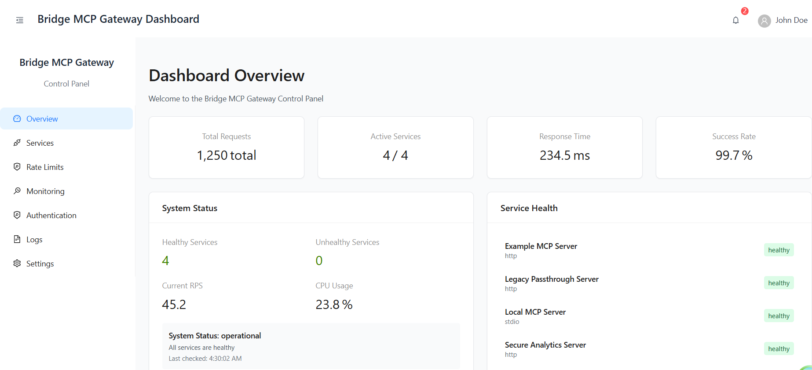

# Bridge MCP Gateway

An open-source Model Context Protocol (MCP) Gateway for secure, scalable, and protocol-compliant AI-tool integration.

In modern enterprises, teams often deploy a diverse set of services, tools, and agents that need to interact securely and efficiently. The MCP Gateway provides a unified entry point for all MCP-compliant services, standardizing authentication, authorization, auditing, and protocol handling. By centralizing these concerns, the gateway reduces integration complexity, enforces consistent security policies, enables observability, and accelerates onboarding of new services—making it easier for organizations to scale, govern, and monitor their service ecosystem.

Traditionally, integrating multiple clients with multiple backend services leads to an m×n explosion of direct connections, custom authentication logic, and inconsistent security enforcement. The MCP Gateway eliminates this complexity by acting as a single, standardized interface: clients connect to the gateway, which securely proxies and manages all interactions with registered MCP services. This architecture decouples clients from backend details, simplifies network topology, and ensures that all traffic is governed by unified authentication, authorization, and auditing policies.

If you are curious to read more - https://medium.com/towards-artificial-intelligence/the-bridge-to-mcp-scaling-ai-tools-with-gateways-e5dd2e9547f8

## Overview

The MCP Gateway acts as a centralized proxy and security layer for MCP servers, enabling secure access control, authentication, monitoring, and protocol bridging for any MCP-compliant service.

## Features

### Current (Phase 1 - MVP) ✅
- ✅ **FastAPI-based async HTTP server** with MCP protocol foundation
- ✅ **Complete OIDC Authentication System** with Keycloak integration and JWT validation
- ✅ **OAuth2 On-Behalf-Of (OBO) Flow** with automatic token exchange and caching
- ✅ **Configurable service registry** with YAML configuration and authentication strategies
- ✅ **Production-grade HTTP proxy** with timeout handling and error management
- ✅ **Comprehensive audit system** with structured logging and event tracking
- ✅ **Rate limiting system** (Redis-based distributed rate limiting)
- ✅ **Health check endpoints** with real-time service monitoring
- ✅ **Dashboard frontend** (React/TypeScript for service management)
- ✅ **Docker-ready containerization** with docker-compose examples

### In Progress (Phase 2 - MCP Protocol Compliance) 🚧
- 🟡 **MCP Client SDK Integration** - Official Python MCP SDK implementation
- 🟡 **Session Management** - Per-client session isolation with connection pooling
- 🟡 **Initialize Handshake** - Required MCP initialize/initialized flow
- 🟡 **Streamable HTTP Support** - Single /mcp endpoint with JSON/SSE responses
- 🟡 **Circuit Breaker Protection** - Per-client failure isolation and recovery
- 🟡 **Enhanced Error Recovery** - Category-based retries with OBO token refresh


### MCP Compliance Implementation
- 📄 [MCP Compliance Implementation Plan](docs/MCP_Compliance_Implementation_Plan.md)

### Planned Features (Phase 3+)
- **RBAC & Policy Engine**: Role-based access control with Open Policy Agent (OPA)
- **Advanced Monitoring**: Prometheus metrics and Grafana dashboards
- **Transport Bridging**: HTTP ↔ stdio protocol interoperability
- **Multi-tenancy**: Tenant isolation and resource quotas
- **Plugin Architecture**: Third-party integrations and community extensions

## Dashboard (Under Development)

The MCP Gateway includes a modern web-based dashboard for monitoring and managing your MCP services. The dashboard provides real-time insights into service health, performance metrics, and system status.



### Dashboard Features
- **Service Management**: View and monitor all configured MCP services
- **Real-time Health Monitoring**: Live service health checks and status updates
- **Performance Metrics**: Response times, success rates, and system performance
- **System Overview**: Total requests, active services, and operational status
- **Responsive Design**: Modern UI built with React and Ant Design

### Accessing the Dashboard
1. Start the MCP Gateway server
2. Start the dashboard development server:
   ```bash
   cd dashboard
   npm install
   npm run dev
   ```
3. Open your browser to `http://localhost:5173`

*Note: The dashboard is currently under active development and new features are being added regularly.*

## Quick Start

### Prerequisites
- Python 3.12+
- [uv](https://github.com/astral-sh/uv) package manager

### Installation

1. **Clone the repository:**
   ```bash
   git clone https://github.com/your-org/mcp-gateway.git
   cd mcp-gateway
   ```

2. **Install dependencies:**
   ```bash
   uv sync
   ```

3. **Set up environment configuration:**
   ```bash
   cp .env.example .env
   # Edit .env with your configuration
   ```

4. **Run the gateway:**
   ```bash
   uv run python -m mcp_gateway.main
   ```

The gateway will start on `http://127.0.0.1:8000` by default.

### Using with uv

This project uses [uv](https://github.com/astral-sh/uv) for fast, reliable Python package management:

```bash
# Install development dependencies
uv sync --extra dev

# Run tests
uv run pytest

# Run with coverage
uv run pytest --cov=mcp_gateway --cov-report=html

# Format code
uv run black src tests
uv run isort src tests

# Type checking
uv run mypy src
```

## Configuration

### Environment Variables

| Variable | Default | Description |
|----------|---------|-------------|
| `HOST` | `127.0.0.1` | Server host address |
| `PORT` | `8000` | Server port |
| `DEBUG` | `false` | Enable debug mode |
| `LOG_LEVEL` | `INFO` | Logging level |
| `LOG_FORMAT` | `json` | Log format (json/text) |
| `SERVICE_REGISTRY_FILE` | `config/services.yaml` | Path to service registry |

### Service Registry

Configure MCP servers in `config/services.yaml`:

```yaml
services:
  example-mcp-server:
    name: "Example MCP Server"
    endpoint: "http://localhost:3000"
    transport: "http"
    timeout: 30
    enabled: true
```

## API Endpoints

### Core Endpoints
- `GET /health` - Health check endpoint
- `GET /docs` - Interactive API documentation (debug mode only)
- `GET /api/v1/services` - List all configured MCP services
- `GET /api/v1/services/{service_id}` - Get detailed service information
- `GET /api/v1/services/{service_id}/health` - Check specific service health

### Dashboard API Endpoints
- `GET /api/v1/dashboard/overview` - Dashboard overview metrics
- `GET /api/v1/dashboard/services/health` - Service health summary for dashboard

*See `/docs` for complete API documentation when running in debug mode.*

## Development

### Project Structure

```
src/mcp_gateway/           # Main application package
├── __init__.py
├── main.py               # Application entry point
├── api/                  # API routes and endpoints
│   ├── routes.py         # Core API routes
│   └── dashboard_routes.py # Dashboard-specific API routes
├── core/                 # Core functionality
│   ├── config.py         # Configuration management
│   ├── logging.py        # Logging setup
│   └── service_registry.py # Service registry management
└── auth/                 # Authentication modules
    └── ...
dashboard/                # React-based web dashboard
├── src/                  # Dashboard source code
├── public/               # Static assets
└── package.json          # Dashboard dependencies
config/                   # Configuration files
├── services.yaml         # Service registry
tests/                    # Test suite
docs/                     # Documentation
└── screenshots/          # Dashboard screenshots
```

### Running Tests

```bash
# Run all tests
uv run pytest

# Run with coverage
uv run pytest --cov=mcp_gateway --cov-report=term-missing

# Run specific test file
uv run pytest tests/test_config.py -v
```

### Code Quality

This project uses several tools for code quality:

```bash
# Format code
uv run black src tests
uv run isort src tests

# Lint code
uv run flake8 src tests

# Type checking
uv run mypy src

# Run all quality checks
uv run pre-commit run --all-files
```

## Docker Deployment

(Docker configuration coming in Phase 1 completion)

## Contributing

We welcome contributions! Please see our [Contributing Guidelines](CONTRIBUTING.md) for details.

### Development Setup

1. Fork and clone the repository
2. Install dependencies: `uv sync --extra dev`
3. Make your changes
4. Run tests: `uv run pytest`
5. Submit a pull request

## Architecture

### Technology Stack

- **Framework**: FastAPI with async/await support and MCP protocol compliance
- **MCP Integration**: Official Python MCP SDK with session management and streaming
- **Authentication**: Authlib for OAuth/OIDC, OBO token exchange with Keycloak
- **Rate Limiting**: Redis-based distributed rate limiting with configurable policies
- **Configuration**: Pydantic for settings validation and environment variables
- **Logging**: Structlog for structured JSON logging with audit trails
- **Testing**: pytest with comprehensive coverage and contract testing
- **Code Quality**: black, isort, flake8, mypy with pre-commit hooks
- **Package Management**: uv for fast dependency resolution and virtual environments
- **Frontend**: React/TypeScript dashboard with Ant Design components

### Design Principles

- **MCP Compliance First**: Full adherence to Model Context Protocol specification
- **Security First**: Secure defaults, zero-trust architecture, and comprehensive audit trails
- **Cloud Native**: Container-ready with health checks, metrics, and horizontal scaling
- **Developer Experience**: Comprehensive tooling, documentation, and clear contribution guidelines
- **Performance**: Async/await for high concurrency with session pooling and circuit breakers
- **Observability**: Structured logging, metrics, tracing, and real-time monitoring built-in

## Roadmap

### Current Status: Phase 2 Implementation 🚧
**MCP Protocol Compliance** - Implementing full Model Context Protocol support with session management, streamable HTTP, and enhanced authentication.

**Branch**: `mcp-spec-compliance`  
**Timeline**: 2-3 weeks for complete MCP compliance  
**Documentation**: [MCP Compliance Implementation Plan](docs/MCP_Compliance_Implementation_Plan.md)

### Detailed Roadmap
See our [Product Requirements Document](docs/MCP_Gateway_PRD.md) for detailed feature roadmap, technical specifications, and implementation phases.

## License

This project is licensed under the Apache 2.0 License - see the [LICENSE](LICENSE) file for details.

## Support & Community

- 📖 **Documentation**: [Technical Docs](docs/) | [Implementation Plan](docs/MCP_Compliance_Implementation_Plan.md)
- 🐛 **Issue Tracker**: [GitHub Issues](https://github.com/codingjam/bridge-mcp/issues) for bug reports and feature requests
- 💬 **Discussions**: [GitHub Discussions](https://github.com/codingjam/bridge-mcp/discussions) for questions and community chat
- 🤝 **Contributing**: See [CONTRIBUTING.md](CONTRIBUTING.md) for contribution guidelines
- 📧 **Contact**: Reach out via GitHub Issues or Discussions for project-related inquiries

### Getting Help
1. **Check existing issues** - Your question might already be answered
2. **Browse the documentation** - Comprehensive guides and API references
3. **Start a discussion** - For questions, ideas, or general community interaction
4. **Open an issue** - For bug reports or specific feature requests
