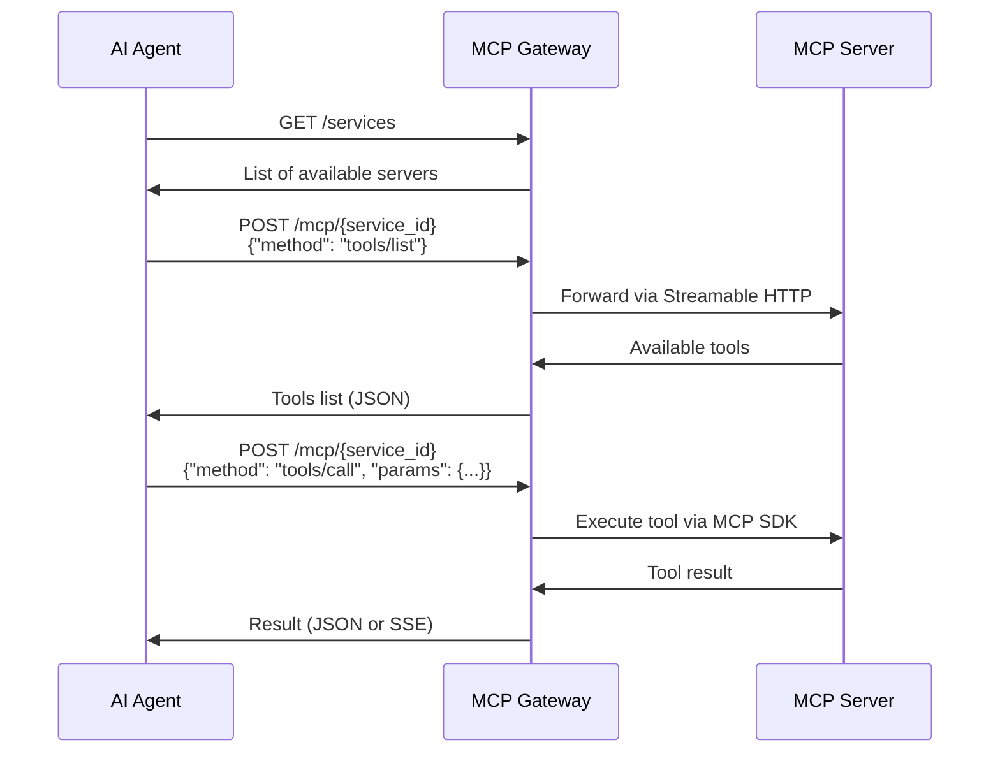

# MCP Gateway Integration Guide for Agent Hosts

> **How to integrate your AI Agent or MCP Client with the MCP Gateway**

## Overview

The MCP Gateway provides a centralized HTTP API that allows AI agents and MCP clients to discover and interact with multiple MCP servers through a single endpoint. This guide explains how to integrate your agent host with the gateway.

**📋 Protocol Version**: This guide reflects MCP protocol specification 2025-03-26, using Streamable HTTP transport with single `/mcp/{service_id}` endpoints instead of deprecated Server-Sent Events (SSE) transport.

**🚀 Current Status**: The gateway is currently in Phase 2 development, implementing full MCP compliance with the Python MCP SDK. Basic HTTP routing and authentication are operational.

## Quick Start

### 1. Gateway Endpoints

Your agent needs to know these key endpoints:

```
Base URL: http://localhost:8000/api/v1

- GET  /services                           # Discover available MCP servers
- GET  /services/{service_id}              # Get details about a specific server
- GET  /services/{service_id}/health       # Check if a server is healthy
- POST /mcp/{service_id}                   # MCP protocol calls (Streamable HTTP)
- GET  /mcp/{service_id}                   # Optional server-push (if supported)
```

### 2. Basic Integration Flow



## Step-by-Step Integration

### Step 1: Discover Available Services

Start by discovering what MCP servers are available through the gateway:

```http
GET http://localhost:8000/api/v1/services
Accept: application/json
```

**Response:**
```json
{
  "count": 3,
  "services": {
    "filesystem": {
      "id": "filesystem",
      "name": "File System Server",
      "description": "Provides file system operations",
      "transport": "http",
      "enabled": true,
      "healthy": true,
      "endpoint": "http://localhost:3001",
      "tags": ["filesystem", "tools"],
      "version": "1.2.0",
      "auth": {
        "strategy": "obo_required",
        "requires_obo": true,
        "target_audience": "filesystem-api"
      }
    },
    "database": {
      "id": "database", 
      "name": "Database Server",
      "description": "SQL database operations",
      "transport": "http",
      "enabled": true,
      "healthy": true,
      "endpoint": "http://localhost:3002",
      "tags": ["database", "sql"],
      "version": "2.1.0",
      "auth": {
        "strategy": "obo_required",
        "requires_obo": true,
        "target_audience": "database-api"
      }
    },
    "web-search": {
      "id": "web-search",
      "name": "Web Search Server",
      "description": "Internet search capabilities", 
      "transport": "http",
      "enabled": true,
      "healthy": true,
      "endpoint": "http://localhost:3003",
      "tags": ["search", "web"],
      "version": "1.0.5",
      "auth": {
        "strategy": "passthrough",
        "requires_obo": false
      }
    }
  }
}
```

### Step 2: Check Service Health (Optional)

Before using a service, verify it's healthy:

```http
GET http://localhost:8000/api/v1/services/filesystem/health
```

**Response:**
```json
{
  "service_id": "filesystem",
  "healthy": true,
  "status": "healthy",
  "endpoint": "http://localhost:3001",
  "health_check_path": "/health"
}
```

### Step 3: Discover Available Tools

For each service you want to use, discover what tools it provides:

```http
POST http://localhost:8000/api/v1/mcp/filesystem
Content-Type: application/json

{
  "method": "tools/list",
  "params": {}
}
```

**Response:**
```json
{
  "result": {
    "tools": [
      {
        "name": "read_file",
        "description": "Read the complete contents of a file",
        "inputSchema": {
          "type": "object",
          "properties": {
            "path": {
              "type": "string",
              "description": "Path to the file to read"
            }
          },
          "required": ["path"]
        }
      },
      {
        "name": "write_file",
        "description": "Write content to a file",
        "inputSchema": {
          "type": "object",
          "properties": {
            "path": {
              "type": "string",
              "description": "Path to the file to write"
            },
            "content": {
              "type": "string", 
              "description": "Content to write to the file"
            }
          },
          "required": ["path", "content"]
        }
      },
      {
        "name": "list_directory",
        "description": "List contents of a directory",
        "inputSchema": {
          "type": "object",
          "properties": {
            "path": {
              "type": "string",
              "description": "Directory path to list"
            }
          },
          "required": ["path"]
        }
      }
    ]
  }
}
```

### Step 4: Execute Tools

Now you can call any tool on any service:

```http
POST http://localhost:8000/api/v1/mcp/filesystem
Content-Type: application/json

{
  "method": "tools/call",
  "params": {
    "name": "read_file",
    "arguments": {
      "path": "/home/user/document.txt"
    }
  }
}
```

**Response:**
```json
{
  "result": {
    "content": [
      {
        "type": "text",
        "text": "This is the content of the file..."
      }
    ]
  }
}
```

### Step 5: Rate Limiting Awareness

The gateway implements comprehensive rate limiting (5 requests per minute per user/service/tool combination). Your agent should handle 429 responses:

```http
HTTP/1.1 429 Too Many Requests
Retry-After: 45

{
  "detail": "Rate limit exceeded"
}
```

## Implementation Examples

### Python Agent Integration

```python
import asyncio
import httpx
from typing import Dict, List, Any

class MCPGatewayClient:
    def __init__(self, gateway_url: str = "http://localhost:8000"):
        self.gateway_url = gateway_url
        self.base_url = f"{gateway_url}/api/v1"
        self.client = httpx.AsyncClient()
    
    async def discover_services(self) -> Dict[str, Any]:
        """Discover all available MCP services"""
        response = await self.client.get(f"{self.base_url}/services")
        response.raise_for_status()
        return response.json()
    
    async def get_service_tools(self, service_id: str) -> List[Dict[str, Any]]:
        """Get available tools for a specific service"""
        response = await self.client.post(
            f"{self.base_url}/mcp/{service_id}",
            json={"method": "tools/list", "params": {}}
        )
        response.raise_for_status()
        data = response.json()
        return data["result"]["tools"]
    
    async def call_tool(self, service_id: str, tool_name: str, **arguments) -> Any:
        """Execute a tool on a specific service"""
        response = await self.client.post(
            f"{self.base_url}/mcp/{service_id}",
            json={
                "method": "tools/call",
                "params": {
                    "name": tool_name,
                    "arguments": arguments
                }
            }
        )
        response.raise_for_status()
        data = response.json()
        return data["result"]
    
    async def check_service_health(self, service_id: str) -> bool:
        """Check if a service is healthy"""
        try:
            response = await self.client.get(f"{self.base_url}/services/{service_id}/health")
            response.raise_for_status()
            data = response.json()
            return data["healthy"]
        except:
            return False
    
    async def close(self):
        """Close the HTTP client"""
        await self.client.aclose()

# Example usage in your agent
async def agent_example():
    gateway = MCPGatewayClient()
    
    try:
        # Discover available services
        services_data = await gateway.discover_services()
        print(f"Found {services_data['count']} services")
        
        # Get tools for filesystem service
        tools = await gateway.get_service_tools("filesystem")
        print(f"Filesystem tools: {[tool['name'] for tool in tools]}")
        
        # Read a file
        result = await gateway.call_tool(
            "filesystem", 
            "read_file", 
            path="/home/user/config.json"
        )
        print(f"File content: {result}")
        
        # Search the web
        search_result = await gateway.call_tool(
            "web-search",
            "web_search",
            query="latest AI developments",
            max_results=5
        )
        print(f"Search results: {search_result}")
        
    finally:
        await gateway.close()

# Run the example
asyncio.run(agent_example())
```

### JavaScript/TypeScript Agent Integration

```typescript
interface MCPService {
  id: string;
  name: string;
  description: string;
  transport: string;
  enabled: boolean;
  healthy: boolean;
  endpoint?: string;
  tags: string[];
  version?: string;
}

interface MCPTool {
  name: string;
  description: string;
  inputSchema: {
    type: string;
    properties: Record<string, any>;
    required: string[];
  };
}

class MCPGatewayClient {
  private baseUrl: string;

  constructor(gatewayUrl: string = 'http://localhost:8000') {
    this.baseUrl = `${gatewayUrl}/api/v1`;
  }

  async discoverServices(): Promise<Record<string, MCPService>> {
    const response = await fetch(`${this.baseUrl}/services`);
    if (!response.ok) throw new Error(`HTTP ${response.status}`);
    const data = await response.json();
    return data.services;
  }

  async getServiceTools(serviceId: string): Promise<MCPTool[]> {
    const response = await fetch(`${this.baseUrl}/mcp/${serviceId}`, {
      method: 'POST',
      headers: { 'Content-Type': 'application/json' },
      body: JSON.stringify({
        method: 'tools/list',
        params: {}
      })
    });
    
    if (!response.ok) throw new Error(`HTTP ${response.status}`);
    const data = await response.json();
    return data.result.tools;
  }

  async callTool(serviceId: string, toolName: string, arguments: Record<string, any>): Promise<any> {
    const response = await fetch(`${this.baseUrl}/mcp/${serviceId}`, {
      method: 'POST',
      headers: { 'Content-Type': 'application/json' },
      body: JSON.stringify({
        method: 'tools/call',
        params: {
          name: toolName,
          arguments
        }
      })
    });
    
    if (!response.ok) throw new Error(`HTTP ${response.status}`);
    const data = await response.json();
    return data.result;
  }

  async checkServiceHealth(serviceId: string): Promise<boolean> {
    try {
      const response = await fetch(`${this.baseUrl}/services/${serviceId}/health`);
      if (!response.ok) return false;
      const data = await response.json();
      return data.healthy;
    } catch {
      return false;
    }
  }
}

// Example usage
async function agentExample() {
  const gateway = new MCPGatewayClient();
  
  // Discover services
  const services = await gateway.discoverServices();
  console.log('Available services:', Object.keys(services));
  
  // Get filesystem tools
  const tools = await gateway.getServiceTools('filesystem');
  console.log('Filesystem tools:', tools.map(t => t.name));
  
  // Read a file
  const fileContent = await gateway.callTool('filesystem', 'read_file', {
    path: '/home/user/data.txt'
  });
  console.log('File content:', fileContent);
}
```

## Error Handling

The gateway returns standard HTTP status codes:

| Status | Meaning | Action |
|--------|---------|--------|
| `200` | Success | Process the response |
| `400` | Bad Request | Check your request format |
| `404` | Service Not Found | Verify service_id exists |
| `502` | Bad Gateway | Backend service is down |
| `503` | Service Unavailable | Service is disabled |
| `504` | Gateway Timeout | Backend service is slow |

**Example Error Response:**
```json
{
  "detail": "Service 'nonexistent-service' not found"
}
```

**Error Handling in Code:**
```python
try:
    result = await gateway.call_tool("filesystem", "read_file", path="test.txt")
except httpx.HTTPStatusError as e:
    if e.response.status_code == 404:
        print("Service not found")
    elif e.response.status_code == 502:
        print("Backend service is down")
    else:
        print(f"Error: {e.response.json()['detail']}")
```

### Service Authentication Awareness

Your agent should be aware of different authentication strategies:

```python
async def handle_service_auth(gateway: MCPGatewayClient, service_id: str):
    services_data = await gateway.discover_services()
    service = services_data["services"].get(service_id)
    
    if not service:
        raise ValueError(f"Service {service_id} not found")
    
    auth_info = service.get("auth", {})
    strategy = auth_info.get("strategy", "no_auth")
    
    if strategy == "obo_required":
        # Service requires On-Behalf-Of token exchange
        # Gateway handles this automatically if user token is valid
        print(f"Service {service_id} requires OBO authentication")
    elif strategy == "passthrough":
        # User token passed directly to service
        print(f"Service {service_id} uses token passthrough")
    elif strategy == "no_auth":
        # No authentication required
        print(f"Service {service_id} is public")
    
    return strategy

# Example usage
strategy = await handle_service_auth(gateway, "filesystem")
result = await gateway.call_tool("filesystem", "read_file", path="/tmp/test.txt")
```

## Advanced Features

### Service Authentication Strategies

Filter services by authentication requirements:

```python
async def get_services_by_auth_strategy(gateway: MCPGatewayClient, strategy: str):
    services_data = await gateway.discover_services()
    
    matching_services = {}
    for service_id, service in services_data["services"].items():
        auth_info = service.get("auth", {})
        if auth_info.get("strategy") == strategy:
            matching_services[service_id] = service
    
    return matching_services

# Get all public services (no authentication required)
public_services = await get_services_by_auth_strategy(gateway, "no_auth")

# Get services that require OBO
secure_services = await get_services_by_auth_strategy(gateway, "obo_required")
```

Filter services by tags, transport, or health status:

```python
async def get_healthy_filesystem_services(gateway: MCPGatewayClient):
    services_data = await gateway.discover_services()
    
    healthy_fs_services = {}
    for service_id, service in services_data["services"].items():
        if (service["healthy"] and 
            service["enabled"] and 
            "filesystem" in service.get("tags", [])):
            healthy_fs_services[service_id] = service
    
    return healthy_fs_services
```

### Batch Tool Discovery

Discover tools for all services efficiently:

```python
async def discover_all_tools(gateway: MCPGatewayClient):
    services_data = await gateway.discover_services()
    all_tools = {}
    
    for service_id, service in services_data["services"].items():
        if service["healthy"] and service["enabled"]:
            try:
                tools = await gateway.get_service_tools(service_id)
                all_tools[service_id] = {
                    "service": service,
                    "tools": tools
                }
            except Exception as e:
                print(f"Failed to get tools for {service_id}: {e}")
    
    return all_tools
```

### Health Monitoring

Monitor service health and automatically retry:

```python
async def robust_tool_call(gateway: MCPGatewayClient, service_id: str, tool_name: str, **arguments):
    # Check health first
    if not await gateway.check_service_health(service_id):
        raise Exception(f"Service {service_id} is unhealthy")
    
    # Retry logic
    for attempt in range(3):
        try:
            return await gateway.call_tool(service_id, tool_name, **arguments)
        except httpx.HTTPStatusError as e:
            if e.response.status_code in [502, 503, 504] and attempt < 2:
                await asyncio.sleep(2 ** attempt)  # Exponential backoff
                continue
            raise
```

## Configuration

### Gateway URL Configuration

Set the gateway URL based on your deployment:

```python
# Development
gateway = MCPGatewayClient("http://localhost:8000")

# Production
gateway = MCPGatewayClient("https://mcp-gateway.your-company.com")

# Docker Compose
gateway = MCPGatewayClient("http://mcp-gateway:8000")
```

### Authentication (When Enabled)

When authentication is enabled, you'll need to provide a valid Bearer token:

```python
class AuthenticatedMCPGatewayClient(MCPGatewayClient):
    def __init__(self, gateway_url: str, access_token: str):
        super().__init__(gateway_url)
        self.client.headers.update({
            "Authorization": f"Bearer {access_token}"
        })

# Usage with OIDC token
gateway = AuthenticatedMCPGatewayClient(
    "http://localhost:8000",
    "eyJhbGciOiJSUzI1NiIsInR5cCI6IkpXVCJ9..."
)
```

The gateway supports different authentication strategies per service:
- **NO_AUTH**: Public services, no authentication required
- **PASSTHROUGH**: User token forwarded directly to service
- **OBO_PREFERRED**: Gateway attempts On-Behalf-Of token exchange, falls back to passthrough
- **OBO_REQUIRED**: Gateway performs On-Behalf-Of token exchange (secure services)
```

## Troubleshooting

### Current Development Status

**Phase 1 Complete (August 2025)**: 
- ✅ Authentication system (OIDC + OBO)
- ✅ Rate limiting (5 requests/minute per user/service/tool)
- ✅ Audit logging and monitoring
- ✅ Service registry and configuration
- ✅ Basic HTTP API endpoints

**Phase 2 In Progress**: 
- 🔄 MCP protocol compliance (Streamable HTTP)
- 🔄 Python MCP SDK integration
- 🔄 Session management and connection pooling
- 🔄 Circuit breaker patterns

**Note**: While basic HTTP endpoints are operational, full MCP protocol support is being finalized in the `mcp-spec-compliance` branch.

### Common Issues

1. **Connection Refused**
   ```
   Error: Connection refused to localhost:8000
   ```
   - Check if the gateway is running
   - Verify the URL and port

2. **Service Not Found**
   ```
   {"detail": "Service 'my-service' not found"}
   ```
   - Check available services with `GET /services`
   - Verify service is enabled in gateway config

3. **Backend Service Down**
   ```
   HTTP 502: Bad Gateway
   ```
   - Check if the backend MCP server is running
   - Verify service health with `GET /services/{id}/health`

4. **Tool Not Found**
   ```
   {"error": {"code": -32601, "message": "Method not found"}}
   ```
   - Verify the tool exists with `tools/list`
   - Check tool name spelling

### Debug Mode

Enable debug logging in your agent:

```python
import logging
logging.basicConfig(level=logging.DEBUG)

# httpx will log all HTTP requests/responses
```

## Production Considerations

1. **Health Checks**: Always check service health before critical operations
2. **Timeouts**: Set appropriate timeouts for your HTTP client
3. **Retries**: Implement retry logic for transient failures
4. **Circuit Breakers**: Disable failing services temporarily
5. **Monitoring**: Log tool usage and errors for debugging
6. **Rate Limiting**: Respect any rate limits imposed by the gateway

## Next Steps

1. **Implement discovery**: Start with service and tool discovery
2. **Build tool registry**: Cache discovered tools for performance
3. **Add error handling**: Implement robust error handling and retries
4. **Monitor health**: Regularly check service health
5. **Optimize performance**: Batch requests where possible
6. **Add authentication**: Prepare for authentication when available

## Support

- **Documentation**: See project README and implementation guides
- **MCP Specification**: https://spec.modelcontextprotocol.io/
- **Issues**: [Report issues on GitHub](https://github.com/codingjam/bridge-mcp/issues)
- **Discussions**: [GitHub Discussions](https://github.com/codingjam/bridge-mcp/discussions)
- **Examples**: Check the `examples/` directory for more integration samples
- **Contributing**: See [CONTRIBUTING.md](../CONTRIBUTING.md) for contribution guidelines
