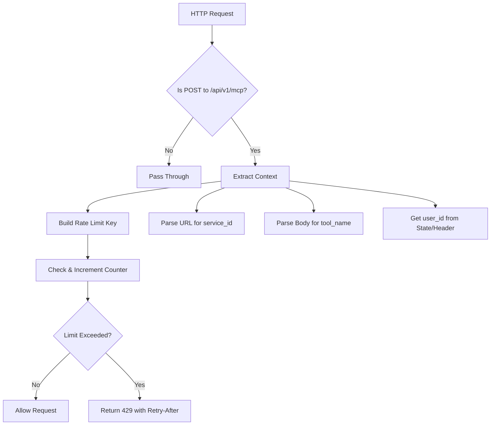

# Rate Limiting System Documentation

> **Production-ready rate limiting system preventing abuse with granular per-user, per-service, per-tool controls**

## Status

**✅ Implemented and Production-Ready**: The rate limiting system is fully operational as of Phase 1 completion (August 2025). All components described in this document are implemented, tested, and ready for production use.

**🛡️ Protection Level**: Provides granular rate limiting with composite keys isolating by user, service, and tool for comprehensive abuse prevention.

## Overview

This document provides a comprehensive overview of the rate limiting system implemented for the MCP Gateway. The system prevents abuse by limiting the number of requests a user can make to specific tools on MCP services within defined time windows.

## Architecture

### Core Components

1. **RateLimitMiddleware** (`rl/middleware.py`)
   - FastAPI middleware that intercepts MCP protocol requests
   - Extracts user, service, and tool context from requests
   - Enforces rate limits and returns 429 status for exceeded limits
   - Integrates seamlessly with existing authentication middleware

2. **RateLimiter** (`rl/limiter.py`)
   - Core rate limiting logic with configurable policies
   - Orchestrates backend operations and policy enforcement
   - Returns allow/deny decisions with retry-after information

3. **LimiterBackend** (`rl/backend.py`)
   - Abstract base class for rate limiting storage backends
   - **MemoryBackend**: Thread-safe in-memory implementation
   - **RedisBackend**: Future Redis-based distributed implementation

4. **RatePolicy** (`rl/limiter.py`)
   - Configuration model for rate limiting rules
   - Defines request limits and time windows
   - Default: 5 requests per 60 seconds

5. **Key Builder** (`rl/keys.py`)
   - Generates composite keys for rate limiting scope
   - Format: `rl:user:{user_id}|service:{service_id}|tool:{tool_name}`
   - Handles normalization and collision prevention

### Configuration System

6. **RateLimitConfig** (`rl/config.py`)
   - Pydantic model for rate limiting configuration
   - Integrates with main gateway settings
   - Supports dependency injection pattern

7. **Environment Integration** (`core/config.py`)
   - Rate limiting settings in main configuration
   - Environment variable support
   - Validation and defaults

## Rate Limiting Strategy

### Composite Key Isolation

The system implements **granular rate limiting** using composite keys that isolate requests by:

- **User ID**: Each user has independent rate limits
- **Service ID**: Each MCP service has independent rate limits  
- **Tool Name**: Each tool within a service has independent rate limits

**Key Format:**
```
rl:user:{user_id}|service:{service_id}|tool:{tool_name}
```

**Example Isolation:**
```
user1 → weather_service → get_weather     (separate limit)
user1 → weather_service → get_forecast    (separate limit)
user1 → news_service → get_weather        (separate limit)
user2 → weather_service → get_weather     (separate limit)
```

### Fixed Window Algorithm

The system uses a **fixed window** rate limiting algorithm:

1. **Window Calculation**: `window_id = floor(current_time / window_seconds)`
2. **Counter Storage**: Each (key, window_id) pair has its own counter
3. **TTL Calculation**: `ttl = ((window_id + 1) * window_seconds) - current_time`
4. **Reset Behavior**: Counters reset at fixed intervals (e.g., every 60 seconds)

### Request Processing Flow



## Configuration

### Environment Variables

```bash
# Rate Limiting Configuration
ENABLE_RATE_LIMITING=true          # Enable/disable rate limiting
RATE_LIMIT_DEFAULT_LIMIT=5         # Default requests per window
RATE_LIMIT_DEFAULT_WINDOW=60       # Default window in seconds
RATE_LIMIT_BACKEND=memory          # Backend type (memory|redis)
RATE_LIMIT_REDIS_URL=redis://...   # Redis URL (if using Redis)
```

### Configuration Model

```python
class RateLimitConfig(BaseModel):
    enabled: bool = True
    default_limit: int = Field(default=5, ge=1, le=1000)
    default_window: int = Field(default=60, ge=1, le=3600)
    backend: str = "memory"
    redis_url: Optional[str] = None
```

### Policy Configuration

```python
# Default policy
policy = RatePolicy(
    limit=5,              # 5 requests
    window_seconds=60     # per 60 seconds
)

# Custom policy
policy = RatePolicy(
    limit=10,             # 10 requests
    window_seconds=300    # per 5 minutes
)
```

## Implementation Details

### Memory Backend

The `MemoryBackend` provides thread-safe in-memory rate limiting:

**Features:**
- Thread-safe operations using `threading.Lock`
- Automatic cleanup of old window data
- Fixed window algorithm implementation
- No external dependencies

**Storage Structure:**
```python
# Internal storage: dict[(key, window_id)] -> count
{
    ("rl:user:alice|service:weather|tool:get_weather", 12345): 3,
    ("rl:user:bob|service:news|tool:get_headlines", 12345): 1,
}
```

**Cleanup Strategy:**
- Removes counters from windows older than current-2
- Runs every 10 windows to prevent memory leaks
- Configurable cleanup frequency

### Middleware Integration

The middleware integrates with the existing FastAPI stack:

**Position in Stack:**
1. CORS Middleware
2. Trusted Host Middleware  
3. **Rate Limit Middleware** ← Applied here
4. Authentication Middleware
5. Application Routes

**Context Extraction:**
```python
async def _extract_context_from_mcp_request(request: Request):
    # Extract user_id from authentication state or header
    user_id = getattr(request.state, 'user_id', None) or \
              request.headers.get('X-User-Id')
    
    # Extract service_id from URL: /api/v1/mcp/{service_id}/call
    service_id = extract_from_path(request.url.path)
    
    # Extract tool_name from MCP request body
    body = await request.body()
    data = json.loads(body)
    tool_name = data.get('params', {}).get('name', 'unknown_tool')
    
    return user_id, service_id, tool_name
```

## API Integration

### Dependency Injection

```python
from mcp_gateway.rl import get_rate_limiter, RateLimitMiddleware

# In main.py
app = FastAPI()

# Get rate limiter instance
limiter = get_rate_limiter()

# Add middleware
app.add_middleware(
    RateLimitMiddleware,
    limiter=limiter,
    apply_to_paths=("/api/v1/mcp",)
)
```

### Error Handling

**Rate Limit Exceeded Response:**
```json
{
  "detail": "Rate limit exceeded"
}
```

**Headers:**
```
HTTP/1.1 429 Too Many Requests
Retry-After: 45
Content-Type: application/json
```

### Custom Exceptions

```python
from mcp_gateway.rl.exceptions import (
    RateLimitExceededError,
    RateLimitBackendError,
    RateLimitConfigurationError
)

try:
    limiter.check_and_consume(key)
except RateLimitExceededError as e:
    print(f"Rate limit exceeded: {e.retry_after} seconds")
```

## Usage Examples

### Basic Usage

```python
from mcp_gateway.rl import RateLimiter, RatePolicy, MemoryBackend

# Create rate limiter
backend = MemoryBackend()
policy = RatePolicy(limit=5, window_seconds=60)
limiter = RateLimiter(backend, policy)

# Check rate limit
allowed, retry_after = limiter.check_and_consume(
    "rl:user:alice|service:weather|tool:get_weather"
)

if allowed:
    # Process request
    print("Request allowed")
else:
    # Return 429
    print(f"Rate limit exceeded, retry in {retry_after} seconds")
```

### Custom Configuration

```python
from mcp_gateway.rl import RateLimitConfig, create_rate_limiter

# Custom configuration
config = RateLimitConfig(
    enabled=True,
    default_limit=10,      # 10 requests
    default_window=300,    # per 5 minutes
    backend="memory"
)

# Create limiter with custom config
limiter = create_rate_limiter(config)
```

### Testing Rate Limits

```python
import pytest
from mcp_gateway.rl import RateLimiter, RatePolicy, MemoryBackend, build_rl_key

def test_rate_limiting():
    backend = MemoryBackend()
    policy = RatePolicy(limit=3, window_seconds=60)
    limiter = RateLimiter(backend, policy)
    
    key = build_rl_key(
        user_id="test_user",
        service_id="test_service", 
        tool_name="test_tool"
    )
    
    # First 3 requests should be allowed
    for i in range(3):
        allowed, _ = limiter.check_and_consume(key)
        assert allowed is True
    
    # 4th request should be blocked
    allowed, retry_after = limiter.check_and_consume(key)
    assert allowed is False
    assert retry_after > 0
```

## Monitoring and Observability

### Structured Logging

The system provides detailed structured logging:

```json
{
  "timestamp": "2025-01-15T10:30:00Z",
  "level": "WARNING",
  "logger": "mcp_gateway.rl.middleware",
  "message": "Rate limit exceeded",
  "user_id": "alice",
  "service_id": "weather_service",
  "tool_name": "get_weather",
  "retry_after": 45,
  "path": "/api/v1/mcp/weather_service/call",
  "rate_limit_key": "rl:user:alice|service:weather_service|tool:get_weather"
}
```

### Metrics Integration

**Key Metrics to Monitor:**
- Rate limit violations per user/service/tool
- Average retry-after times
- Backend performance (memory usage, operation latency)
- Rate limiting effectiveness (blocked vs allowed requests)

**Log Analysis Queries:**
```bash
# Rate limit violations by user
grep "Rate limit exceeded" | jq '.user_id' | sort | uniq -c

# Most frequently blocked tools
grep "Rate limit exceeded" | jq '.tool_name' | sort | uniq -c

# Average retry-after times
grep "Rate limit exceeded" | jq '.retry_after' | awk '{sum+=$1} END {print sum/NR}'
```

## Performance Considerations

### Memory Backend Performance

- **Time Complexity**: O(1) for increment operations
- **Space Complexity**: O(users × services × tools × active_windows)
- **Cleanup Overhead**: Minimal, runs every 10 windows
- **Thread Safety**: Lock-based, suitable for moderate concurrency

### Scaling Considerations

**Memory Backend Limits:**
- Single-node only (no shared state)
- Memory usage grows with active keys
- Lock contention under high concurrency

**Redis Backend Benefits (Future):**
- Distributed rate limiting across multiple gateway instances
- Persistent storage survives restarts
- Advanced data structures (sorted sets, expiration)
- Higher concurrency through optimistic locking

### Performance Optimization

```python
# Optimize cleanup frequency
class MemoryBackend(LimiterBackend):
    def _cleanup_old_windows(self, current_window_id: int, window_seconds: int):
        # Clean every 50 windows instead of 10 for higher performance
        if current_window_id % 50 == 0:
            # ... cleanup logic
```

## Security Considerations

### Input Validation

- User IDs sanitized through authentication middleware
- Service IDs validated against service registry
- Tool names extracted from trusted MCP protocol messages
- Delimiter characters replaced to prevent key collisions

### Rate Limit Bypass Prevention

- Middleware applied before authentication to prevent bypass
- Context extraction validates all required fields
- Backend operations are atomic to prevent race conditions
- Key normalization prevents case-based bypass attempts

### Resource Protection

- Memory backend includes cleanup to prevent memory exhaustion
- Configurable limits prevent resource abuse
- Error handling prevents backend failures from breaking requests

## Troubleshooting

### Common Issues

**1. Rate Limiting Not Working**
```bash
# Check configuration
grep RATE_LIMIT .env

# Verify middleware is loaded
grep -r "RateLimitMiddleware" src/

# Check logs for initialization
grep "Rate limiting middleware initialized" logs/
```

**2. High Memory Usage**
```python
# Check backend cleanup
logger.info(f"Active counters: {len(backend._counters)}")

# Adjust cleanup frequency
# Reduce RATE_LIMIT_DEFAULT_WINDOW for faster cleanup
```

**3. Users Bypassing Rate Limits**
```bash
# Check user_id extraction
grep "user_id missing" logs/

# Verify authentication middleware order
# RateLimitMiddleware should be BEFORE AuthenticationMiddleware
```

**4. Tool Names Not Detected**
```bash
# Check MCP request format
grep "unknown_tool" logs/

# Verify request body parsing
# Body should contain: {"method": "tools/call", "params": {"name": "tool_name"}}
```

### Debug Mode

```python
# Enable debug logging
import logging
logging.getLogger("mcp_gateway.rl").setLevel(logging.DEBUG)

# Log all rate limit checks
logger.debug(
    "Rate limit check",
    extra={
        "key": key,
        "current_count": count,
        "limit": policy.limit,
        "allowed": allowed
    }
)
```

## Future Enhancements

### Redis Backend Implementation

```python
class RedisBackend(LimiterBackend):
    """Redis-based distributed rate limiting backend."""
    
    def __init__(self, redis_url: str):
        import redis
        self.redis = redis.from_url(redis_url)
    
    async def incr_and_get(self, key: str, window_seconds: int) -> Tuple[int, int]:
        # Use Redis MULTI/EXEC for atomic operations
        # Implement sliding window with sorted sets
        # Add automatic expiration
        pass
```

### Advanced Features

1. **Per-Service Rate Limits**: Different limits for different services
2. **User Tiers**: Different limits based on user subscription level
3. **Adaptive Rate Limiting**: Adjust limits based on service health
4. **Rate Limit Quotas**: Daily/monthly limits in addition to per-minute
5. **Circuit Breaker Integration**: Temporary rate limit increases during service degradation

### Metrics Dashboard

```python
# Prometheus metrics integration
from prometheus_client import Counter, Histogram

rate_limit_violations = Counter(
    'rate_limit_violations_total',
    'Total rate limit violations',
    ['user_id', 'service_id', 'tool_name']
)

rate_limit_latency = Histogram(
    'rate_limit_check_duration_seconds',
    'Time spent checking rate limits'
)
```

## Testing

### Unit Tests

The system includes comprehensive unit tests covering:

- Key generation and normalization
- Memory backend operations
- Rate limiter policy enforcement
- Middleware request processing
- Configuration management
- Error handling

### Integration Tests

```python
@pytest.mark.asyncio
async def test_user_cannot_invoke_tool_more_than_5_times_per_minute():
    """Test the core requirement: 5 requests per minute limit."""
    # Create rate limiter with 5/60 policy
    # Make 5 successful requests
    # Verify 6th request is blocked
    # Test isolation between users/services/tools
```

### Load Testing

```python
# Concurrent rate limit testing
import asyncio
import aiohttp

async def load_test():
    # Simulate multiple users hitting rate limits
    # Measure backend performance under load
    # Verify thread safety
```

## Migration Guide

### Enabling Rate Limiting

1. **Update Environment Variables:**
   ```bash
   echo "ENABLE_RATE_LIMITING=true" >> .env
   echo "RATE_LIMIT_DEFAULT_LIMIT=5" >> .env
   echo "RATE_LIMIT_DEFAULT_WINDOW=60" >> .env
   ```

2. **Restart Gateway:**
   ```bash
   # Rate limiting middleware will be automatically loaded
   python -m mcp_gateway.main
   ```

3. **Monitor Logs:**
   ```bash
   grep "Rate limiting middleware initialized" logs/gateway.log
   ```

### Customizing Limits

```python
# In main.py - custom rate limiter
from mcp_gateway.rl import RateLimitConfig, create_rate_limiter

config = RateLimitConfig(
    default_limit=10,      # 10 requests
    default_window=300     # per 5 minutes  
)
limiter = create_rate_limiter(config)

app.add_middleware(RateLimitMiddleware, limiter=limiter)
```

## Conclusion

The Rate Limiting system provides robust protection against abuse while maintaining high performance and flexibility. The modular design allows for easy configuration and future enhancements, ensuring the MCP Gateway can scale to meet evolving requirements.

Key benefits:
- ✅ **Granular Control**: Per-user, per-service, per-tool rate limiting
- ✅ **High Performance**: Thread-safe in-memory backend with cleanup
- ✅ **Easy Configuration**: Environment variable and dependency injection support
- ✅ **Comprehensive Testing**: Full test coverage with integration tests
- ✅ **Production Ready**: Structured logging, error handling, and monitoring support
