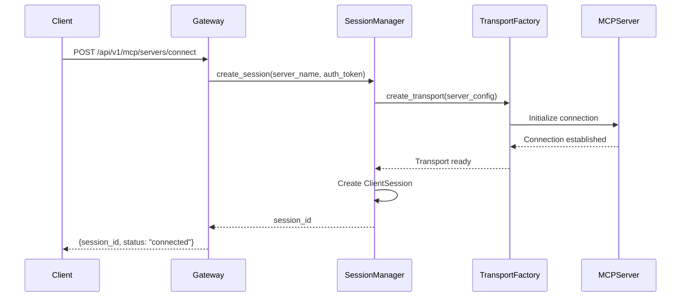

# Session Management Architecture

This document explains how session creation and management is implemented in the MCP Gateway project, providing a detailed overview of the architecture, lifecycle, and technical implementation details.

## Overview

The MCP Gateway implements a sophisticated session management system that handles the lifecycle of connections to MCP (Model Context Protocol) servers. The system is designed to provide:

- **Connection Pooling**: Efficient reuse of MCP connections
- **Transport Lifecycle Management**: Proper initialization and cleanup of transport layers
- **Session Isolation**: Each client gets isolated sessions with their own authentication context
- **Error Handling**: Robust error recovery and connection state management
- **Resource Management**: Automatic cleanup of resources to prevent memory leaks

## Architecture Components

### 1. Session Manager (`src/mcp_gateway/mcp/session_manager.py`)

The core component responsible for managing MCP session lifecycle.

#### Key Responsibilities:
- Creating and maintaining MCP client sessions
- Managing transport connections (HTTP, stdio)
- Handling session cleanup and resource deallocation
- Connection pooling and reuse
- Error recovery and reconnection logic

#### Core Methods:

```python
class SessionManager:
    async def create_session(self, server_name: str, auth_token: str) -> str
    async def get_session(self, session_id: str) -> ClientSession
    async def close_session(self, session_id: str) -> bool
    async def cleanup_expired_sessions(self) -> None
```

### 2. Transport Factory (`src/mcp_gateway/mcp/transport_factory.py`)

Responsible for creating and configuring transport connections to MCP servers.

#### Key Features:
- **URL Normalization**: Ensures proper endpoint formatting with trailing slashes
- **Transport Selection**: Supports HTTP and stdio transports
- **Async Context Management**: Proper lifecycle handling with `@asynccontextmanager`
- **Error Handling**: Comprehensive exception logging and recovery

#### Transport Types:
- **HTTP Transport**: For web-based MCP servers
- **Stdio Transport**: For local process-based MCP servers

### 3. Client Wrapper (`src/mcp_gateway/mcp/client_wrapper.py`)

Provides a high-level interface for interacting with MCP servers through established sessions.

#### Capabilities:
- Tool discovery and execution
- Resource listing and reading
- Prompt template management
- Response serialization and error handling

## Session Lifecycle

### 1. Session Creation Flow



### 2. Session Management States

| State | Description | Actions Available |
|-------|-------------|-------------------|
| `CREATING` | Session initialization in progress | None |
| `CONNECTED` | Active session ready for operations | All MCP operations |
| `ERROR` | Session encountered an error | Retry connection |
| `CLOSING` | Session cleanup in progress | None |
| `CLOSED` | Session terminated | Create new session |

### 3. Session Cleanup Process

```python
async def _close_session_internal(self, session_data: SessionData) -> None:
    """Internal session cleanup with proper resource management."""
    try:
        # Close MCP client session
        if session_data.session:
            await session_data.session.__aexit__(None, None, None)
        
        # Close transport connection
        if session_data.transport:
            await session_data.transport.__aexit__(None, None, None)
            
        # Clean up HTTP client session
        if session_data.client_session:
            await session_data.client_session.close()
            
    except Exception as e:
        logger.error("Error during session cleanup", 
                    session_id=session_data.session_id, error=str(e))
```

## Authentication Integration

### On-Behalf-Of (OBO) Token Flow

The session management system integrates with OAuth2 OBO token exchange:

1. **User Authentication**: Client authenticates with Keycloak
2. **Token Exchange**: Gateway exchanges user token for service-specific token
3. **Session Binding**: Each session is bound to the exchanged service token
4. **Token Refresh**: Automatic token refresh for long-lived sessions

```python
# Token is associated with each session
session_data = SessionData(
    session_id=session_id,
    server_name=server_name,
    auth_token=service_token,  # OBO exchanged token
    created_at=datetime.utcnow(),
    last_accessed=datetime.utcnow()
)
```

## Connection Pooling Strategy

### Pool Management

The session manager implements connection pooling to optimize resource usage:

```python
# Session pool with configurable limits
self.sessions: Dict[str, SessionData] = {}
self.max_sessions_per_server = 10
self.session_timeout = timedelta(hours=1)
```

### Pool Cleanup

Automatic cleanup of expired sessions:

```python
async def cleanup_expired_sessions(self) -> None:
    """Remove expired sessions and free resources."""
    current_time = datetime.utcnow()
    expired_sessions = [
        session_id for session_id, data in self.sessions.items()
        if current_time - data.last_accessed > self.session_timeout
    ]
    
    for session_id in expired_sessions:
        await self.close_session(session_id)
```

## Error Handling and Recovery

### Transport-Level Errors

The system handles various transport-level failures:

- **Connection Timeouts**: Automatic retry with exponential backoff
- **Network Errors**: Graceful degradation and reconnection
- **Server Unavailability**: Circuit breaker pattern (planned)

### Session-Level Errors

Session-specific error handling:

```python
try:
    # Perform MCP operation
    result = await session.call_tool(tool_name, arguments)
except Exception as e:
    logger.error("Tool call failed", 
                session_id=session_id, 
                tool_name=tool_name, 
                error=str(e))
    
    # Mark session as potentially corrupted
    await self._handle_session_error(session_id, e)
```

## Configuration

### Session Configuration

Sessions are configured through `config/services.yaml`:

```yaml
services:
  fin-assistant-mcp:
    url: "http://localhost:3001/mcp/"  # Note trailing slash
    auth_strategy: "obo_token"
    transport_type: "http"
    timeout: 30
    max_sessions: 10
```

### Environment Variables

Key configuration options:

- `SESSION_TIMEOUT_HOURS`: Session expiration time (default: 1 hour)
- `MAX_SESSIONS_PER_SERVER`: Connection pool limit (default: 10)
- `CLEANUP_INTERVAL_MINUTES`: Cleanup task frequency (default: 15 minutes)

## Monitoring and Observability

### Logging

Structured logging with key session metrics:

```python
logger.info("Session created successfully",
           session_id=session_id,
           server_name=server_name,
           transport_type="http",
           duration_ms=int((time.time() - start_time) * 1000))
```

### Metrics (Planned)

Future monitoring capabilities:

- Active session count per server
- Session creation/destruction rates
- Average session lifetime
- Error rates by error type
- Transport performance metrics

## Best Practices

### 1. Session Lifecycle Management

- Always use the session manager for creating sessions
- Ensure proper cleanup with try/finally blocks
- Monitor session count to prevent resource exhaustion

### 2. Error Handling

- Implement retry logic for transient failures
- Log detailed error context for debugging
- Provide meaningful error messages to clients

### 3. Security Considerations

- Validate session ownership before operations
- Implement session timeout for security
- Securely store and handle authentication tokens

### 4. Performance Optimization

- Reuse sessions when possible
- Implement connection pooling
- Monitor and tune session timeout values
- Use async/await properly to avoid blocking

## Integration Examples

### Creating a Session

```python
# Via REST API
response = requests.post(
    "http://localhost:8000/api/v1/mcp/servers/connect",
    headers={"Authorization": f"Bearer {jwt_token}"},
    json={"server_name": "fin-assistant-mcp"}
)
session_data = response.json()
session_id = session_data["session_id"]
```

### Using a Session

```python
# List tools
tools_response = requests.get(
    f"http://localhost:8000/api/v1/mcp/sessions/{session_id}/tools",
    headers={"Authorization": f"Bearer {jwt_token}"}
)

# Call a tool
result = requests.post(
    f"http://localhost:8000/api/v1/mcp/sessions/{session_id}/tools/call",
    headers={"Authorization": f"Bearer {jwt_token}"},
    json={
        "tool_name": "get_statement",
        "arguments": {"account": "checking", "month": "2024-01"}
    }
)
```

### 4. Session Creation Flow Diagram

The following flowchart illustrates the detailed session creation process:

```
POST /api/v1/mcp/servers/connect
             ↓
    SessionManager.create_session()
             ↓
  MCPTransportFactory.create_transport(cfg)
             ↓
    normalize URL (ensure /mcp/)
             ↓
transport_cm.__aenter__() // streamablehttp_client
             ↓
      ClientSession.__aenter__()
             ↓
  ClientSession.initialize() // 30s timeout
             ↓
          init OK? ────────┐
             ↓            │
           YES            NO
             ↓            ↓
    store in pools:       │
    - sessions           │
    - transports         │
    - session_info       │
             ↓            ↓
   start heartbeat task  │
             ↓            ↓
     return session_id    │
                          ↓
                ClientSession.__aexit__()
                transport_cm.__aexit__()
                     raise exception
```

## Future Enhancements

### Planned Features

1. **Circuit Breaker Pattern**: Automatic failure detection and recovery
2. **Health Check Integration**: Proactive session health monitoring
3. **Session Persistence**: Optional session state persistence across restarts
4. **Load Balancing**: Distribution of sessions across multiple server instances
5. **Metrics Dashboard**: Real-time session management monitoring
6. **Session Migration**: Moving sessions between gateway instances

### Scalability Considerations

- **Horizontal Scaling**: Session affinity and distributed session storage
- **Resource Limits**: Per-user and per-server session quotas
- **Background Tasks**: Efficient cleanup and maintenance processes

## Troubleshooting

### Common Issues

1. **Session Creation Fails**
   - Check server configuration in `services.yaml`
   - Verify authentication token validity
   - Ensure MCP server is accessible

2. **Sessions Timeout Unexpectedly**
   - Review session timeout configuration
   - Check for network connectivity issues
   - Monitor server-side session limits

3. **Memory Leaks**
   - Verify session cleanup is working
   - Check for unclosed transport connections
   - Monitor session pool size

### Debug Logging

Enable debug logging for detailed session information:

```python
import logging
logging.getLogger("mcp_gateway.mcp.session_manager").setLevel(logging.DEBUG)
```

This will provide detailed logs about session creation, management, and cleanup operations.
